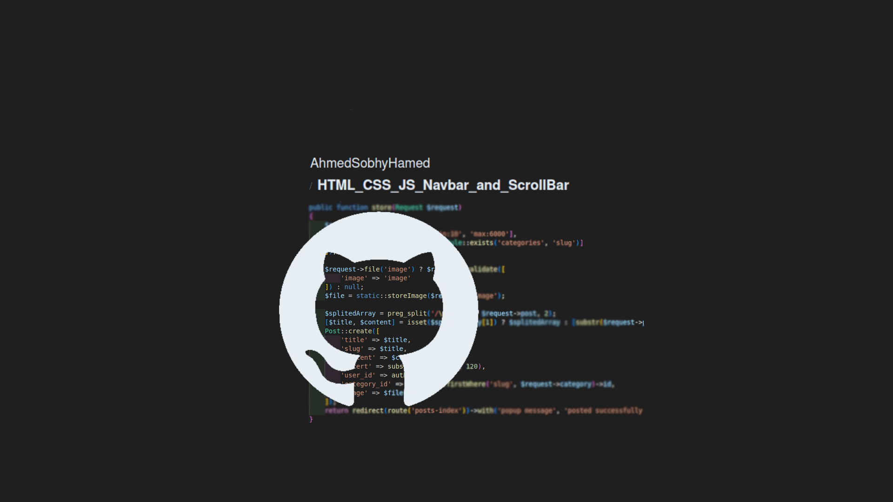

# HTML_CSS_PROJECTS

Three front-end tamplate projects and a small section as a fourth prohect using HTML and CSS.


## Table of Contents

- [Introduction](#introduction)
- [Features](#features)
- [Usage](#usage)
- [Technologies Used](#technologies-used)
- [Project Structure](#project-structure)
- [License](#license)
- [Contact](#contact)

  <!-- intro -->

## Introduction

This project is front-end project using HTML and CSS to create a responsive web pages.
in addetion, it have a lot of animation effects and interaction effects within the range achievable with CSS alone.
<br>
the first three project are popular designs that I took from the Elzero courses.

**I added a small file in the root dirctory to refer to every project.**

  <!-- technologies was used with links if available -->

## Features

- Create responsive web pages.
  <br>
  Example:

  ```css
  @media (min-width: 578px) {
    .navbar .links > li > a {
      ...
  }
  ```

- Using the flexbox system.
  <br>
  Example:

  ```css
  .inner-links ul li a {
    ...
    display: flex;
    justify-content: flex-start;
    align-items: center;
  }
  ```

- Using the grid system.
  <br>
  Example:

  ```css
  .galary .ASH-grid-container {
    grid-template-columns: repeat(auto-fill, 350px);
  }
  ```

- Implementing linear gradient and radial gradient to create a background images.
  <br>
  Example:

  ```css
  .fut-card:nth-of-type(3) footer a {
    ...
    background-image: linear-gradient(to right, #2eb2ff 50%, transparent 50%);
  }
  ```

- Implementing, either a simple transition or a fully animated actions.
  <br>
  Example:

  ```css
  @keyframes arrow-up-down {
    70% {
      transform: translateY(0px);
    }
    ...;
  }
  ```

  ```css
  .inner-links {
    ...
    transition: opacity 0.5s, top 0.5s;
  }
  ```

- Create a dropdown menu.
  <br>
  Example:

  ```html
  <li class="anime1">
    <a href="">other links</a>
    <div class="inner-links ASH-flex-row-sp-c">
      <div>
        
      </div>
      <ul class="ASH-flex-row-ev-c">
        <li>
          <a href="">
            <i class="far fa-comment fa-fw"></i>
            <span>tastominials</span>
          </a>
        </li>
        ...
      </ul>
    </div>
  </li>
  ```

- Implementing pseudo-classes and pseudo-elements.
  <br>
  Example:

  ```css
  .navbar .links > li > a::before{}
  .testom-card div[stars-number="3"] i:nth-of-type(3)::before{}
  .white-box input::placeholder{}
  .inner-links > div:first-of-type{}
  .inner-links ul li:nth-child(10){}
  ...
  ```

- CSS system to reflect the data from HTML attribute (used in project 3).
  <br>
  Example:

  ```css
  .skill-bar[data-advance ^= "0"] {}
  .skill-bar[data-advance ^= "1"] {}
  .skill-bar[data-advance ^= "2"] {}
  .skill-bar[data-advance ^= "3"] {}
  ...
  ```

  <!-- usage or how to interact with this technologies like api end points and what they do -->

## Usage

**You can interact with the project via this link**
[web page on github](https://ahmedsobhyhamed.github.io/HTML_CSS_PROJECTS/).
<br>
**[see an example for user interaction.[video]](http://youtube.com)**
<br>
**[demonstration video for developer communit](https://www.youtube.com/watch?v=QrMDQQKTNyU)**

## Technologies Used

- HTML 5.
- Pure CSS.
- Use font awesome CSS library.

  <!-- about the project and a digram of how it work -->

## Project Structure

- CSS general rules:
  - projectPage_folder/css/normalize.css
- CSS custom style:
  - projectPage_folder/css/generalroles.css
  - projectPage_folder/css/style.css
- HTML files:
  - projectPage_folder/index.html

    <!-- licance -->

## License

This project is licensed under the MIT License - see the [LICENSE](/LICENSE) file for details

  <!-- contacts -->

## Contact

Created by [Ahmed Sobhy]:

- email: [ahmed.s.abdulaal@gmail.com](mailto:ahmed.s.abdulaal@gmail.com)
- linkedin: [Ahmed Sobhy](https://www.linkedin.com/in/ahmed-sobhy-b824b7201/)
  <br>
  feel free to contact me!
