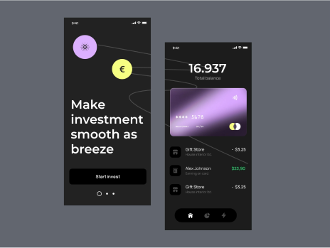

# HTML_CSS_JS_Navbar_and_ScrollBar

Project that preview usage of three libraries for NavBar, Not identical image galary, Carasol or ScrollBar.


## Table of Contents

- [Introduction](#introduction)
- [Features](#features)
- [Installation](#installation)
- [Usage](#usage)
- [Technologies Used](#technologies-used)
- [Project Structure](#project-structure)
- [License](#license)
- [Contact](#contact)

  <!-- intro -->

## Introduction

In this project i used three libraries and i will excplain how to use them.
<br>
by compining CSS and JavaScript to create a responsive and interactive NavBar.
<br>
by compining CSS and JavaScript to create a galary wall for imagaes that have a differ dimintions.
<br>
by compining CSS and JavaScript to create a scroll bar that can clickable for go forward and backward or click on the indexed place , or use the auto scroll future.

  <!-- technologies was used with links if available -->

## Features

#### Library NavBar

```diff
    Change the way to interact. that user can open menus with click or hover.
    Responsive design for mobile and desktop.
```

#### Library VerticalTempalateBilder

```diff
    Easy way to add images with differ dimintions.
    Custom number of column for every screen width.
    Enable/Disable re render when screen width changes.
```

#### Library ImgScroller

```diff
    Easy way to add images to scrollbar.
    Add an arrows or index dashes to easy navigate.
    Enable/Disable auto scrolling.
    Enable/Disable keybaord arrows navigation.
```

  <!-- get start and how to run with the prerequisites mintion -->

## Installation

#### Library NavBar

1. Clone the repository:

```sh
git clone https://github.com/AhmedSobhyHamed/HTML_CSS_JS_Navbar_and_ScrollBar.git
```

2. Copy Library dependencies:

```sh
cp <repo dir>/style/navbar.css <project css dir>/navbar.css
cp <repo dir>/style/media.css <project css dir>/media.css
cp <repo dir>/script/NavBar.css <project js dir>/NavBar.css
```

3. In your css styling file:

- copy the styles you want from style file

```diff
style/style.css
```

- include style files

```css
@import url("navbar.css");
@import url("media.css");
```

or link them in HTML file

```html
<link rel="stylesheet" href="style/navbar.css" />
<link rel="stylesheet" href="style/media.css" />
```

4. In your script file:

- import the library

```js
import NavBar from "./NavBar.js";
```

- create instance with navigation bar id

```js
let nav = new NavBar("#navsection");
```

- choose the way to interacte with navigation bar

```js
nav.enableClickActive();
```

or

```js
nav.enableHoverActive();
```

5. in HTML file insert and edit this script:

```html
<nav>
  <div class="container nav" id="navsection">
    <div class="logo-section">
      
    </div>
    <div class="nav-menu">
      <div class="menu-btn">
        <span></span>
        <span></span>
        <span></span>
      </div>
      <div class="menu-list">
        <ul class="menu-content">
          <li><a href="#">home</a></li>
          ...
        </ul>
      </div>
    </div>
    <div class="left-side">
      <!-- optionally  -->
      <span>menu</span>
      <span class="ver-lines">
        <span></span>
        <span></span>
        <span></span>
      </span>
    </div>
  </div>
</nav>
```

#### Library VerticalTempalateBilder

1. Clone the repository:

```sh
git clone https://github.com/AhmedSobhyHamed/HTML_CSS_JS_Navbar_and_ScrollBar.git
```

2. Copy Library dependencies:

```sh
cp <repo dir>/style/projects.css <project css dir>/projects.css
cp <repo dir>/style/media.css <project css dir>/media.css
cp <repo dir>/script/VerticalTempalateBilder.css <project js dir>/VerticalTempalateBilder.css
```

3. In your css styling file:

- copy the styles you want from style file

```diff
style/style.css
```

- include style files

```css
@import url("projects.css");
@import url("media.css");
```

or link them in HTML file

```html
<link rel="stylesheet" href="style/projects.css" />
<link rel="stylesheet" href="style/media.css" />
```

4. In your script file:

- import the library

```js
import VerticalTemplateBilder from "./VerticalTemplateBilder.js";
```

- create instance with galary wall id and optionally as a second argument insert a number of how many pixcels that represents one unit in grid rows, and third argument that represents gap between images as number in row unit.

```js
let projects = new VerticalTemplateBilder("#projectsGalary", 5, 1);
```

- establish the grid column per media width

```js
projects.setGridColumn({ 0: 1, 576: 2, 992: 4 });
```

- enable re-render when screen width changes.

```js
projects.enableVWevent();
```

5. in HTML file insert and edit this script:

```html
<section id="projects">
  <div class="container">
    <h2 class="title">projects</h2>
    <div class="project-grid-parent" id="projectsGalary">
      ...
      <div class="project-grid-child">
        
      </div>
      ...
      <div class="project-grid-child project-text-area" grid-row-height="18">
        <h3>How we design web3 projects</h3>
        <span class="project-padge">coming soon</span>
      </div>
      ...
    </div>
  </div>
</section>
```

#### Library ImgScroller

1. Clone the repository:

```sh
git clone https://github.com/AhmedSobhyHamed/HTML_CSS_JS_Navbar_and_ScrollBar.git
```

2. Copy Library dependencies:

```sh
cp <repo dir>/style/projects.css <project css dir>/projects.css
cp <repo dir>/style/media.css <project css dir>/media.css
cp <repo dir>/script/ImgScroller.css <project js dir>/ImgScroller.css
```

3. In your css styling file:

- copy the styles you want from style file

```diff
style/style.css
```

- include style files

```css
@import url("projects.css");
@import url("media.css");
```

or link them in HTML file

```html
<link rel="stylesheet" href="style/projects.css" />
<link rel="stylesheet" href="style/media.css" />
```

4. In your script file:

- import the library

```js
import ImgScroller from "./ImgScroller.js";
```

- create instance with image scroll bar id.

```js
let otherProjects = new ImgScroller("#otherProjectScroll");
```

- use screen arrows

```js
otherProjects.enableLeftArrow();
otherProjects.enableRightArrow();
```

```html
...
<div class="scroll-indecators">
  <div class="scroll-left icon-arrow-left2">&lt;</div>
  <div class="scroll-right icon-arrow-right2">&gt;</div>
</div>
...
```

- use index referance.

```js
otherProjects.enableIndexClick();
```

```html
...
<div class="scroll-indexs"></div>
...
```

- enable auto scroll.

```js
otherProjects.enableAutoMove();
```

- use keyboard control.

```js
otherProjects.enableKeyboard();
```

5. in HTML file insert and edit this script:

```html
<section id="otherProject">
  <div class="project-scroll" id="otherProjectScroll">
    <div class="scroll-view">
      
      
      ...
    </div>
    <div class="scroll-control">
      <!-- optionally  -->
      <div class="scroll-indexs"></div>
      <!-- optionally  -->
      <div class="scroll-indecators">
        <div class="scroll-left icon-arrow-left2">&lt;</div>
        <div class="scroll-right icon-arrow-right2">&gt;</div>
      </div>
    </div>
  </div>
</section>
```

  <!-- usage or how to interact with this technologies like api end points and what they do -->

## Usage

**You can interact with the project via this link**
[web page on github](https://ahmedsobhyhamed.github.io/HTML_CSS_JS_Navbar_and_ScrollBar/).
<br>
**[see an example for user interaction.[video]](http://youtube.com)**

## Technologies Used

- Vanilla JavaScript.
- OOP concepts.
- HTML 5.
- CSS.

  <!-- about the project and a digram of how it work -->

## Project Structure

- NavBar Library:

  - css files:
    - style/navbar.css
    - style/media.css
    - style/style.css
  - js files:
    - script/NavBar.js
    - script.js

- Galary wall Library:

  - css files:
    - style/projects.css
    - style/media.css
    - style/style.css
  - js files:
    - script/VerticalTempalateBilder.js
    - script.js

- Scroll bar Library:

  - css files:
    - style/projects.css
    - style/media.css
    - style/style.css
  - js files:
    - script/ImgScroller.js
    - script.js

- HTML files:

  - index.html

    <!-- licance -->

## License

This project is licensed under the MIT License - see the [LICENSE](/LICENSE) file for details

  <!-- contacts -->

## Contact

Created by [Ahmed Sobhy]:

- email: [ahmed.s.abdulaal@gmail.com](mailto:ahmed.s.abdulaal@gmail.com)
- linkedin: [Ahmed Sobhy](https://www.linkedin.com/in/ahmed-sobhy-b824b7201/)
  <br>
  feel free to contact me!
